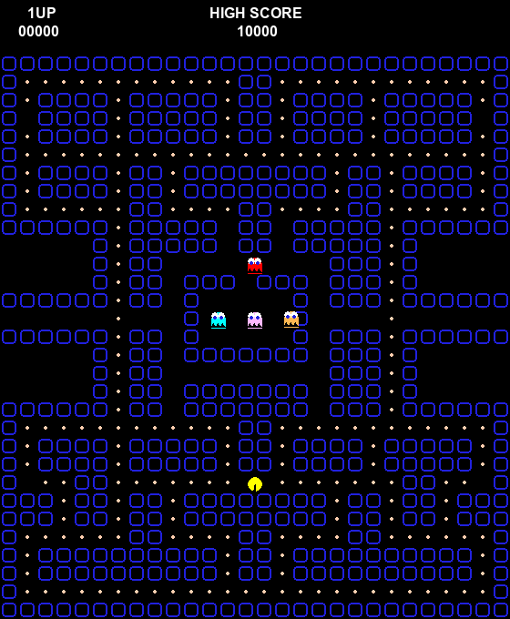

# Theory of Vantage 🧠

**A Falsifiable Framework for Testing Consciousness in Neural Networks**

[](https://opensource.org/licenses/MIT)

---

## 🎮 The Pacman Paradigm

We use a classic Pacman game as our testbed for consciousness research. The twist: **Pacman's brain is a spiking neural network** (300 Izhikevich neurons), while **Ghosts are feedforward MLPs** (philosophical zombies).


*Pacman navigating with a biologically-inspired recurrent neural network*

---

## 🔬 The Hard Problem

David Chalmers asked: *Why does physical processing give rise to subjective experience?*

We reformulate this as a **falsifiable question**: *Can we dissociate Function (behavior) from Phenomenology (consciousness)?*

### Our Experiments

| Test | Theory | Pacman | Ghosts | Result |
|------|--------|--------|--------|--------|
| **Ignition** | GWT | ✅ 100% | 45% | PASSED |
| **Prediction** | FEP | ✅ +2.78 MMN | 0.00 | PASSED |
| **Bisection** | IIT | ❌ Reducible | — | FAILED |
| **Complexity** | PCI | ❌ 0.09 | 0.06 | FAILED |
| **Synchrony** | NCC | ⚠️ 0.88 | 0.99 | AMBIGUOUS |

---

## 🧟 The Zombie Proof

We attempted to create a "Philosophical Zombie" (action without consciousness) by lesioning neural pathways.

### Key Finding: Architecture Matters

| Architecture | Post-Lesion Behavior | Result |
|--------------|---------------------|--------|
| **UNIFIED** (Single Network) | 0% | 💀 Collapsed |
| **DUAL-PATHWAY** (Reflex + Cortical) | 24% | ✅ Survived |



**Conclusion:** Zombies are **only possible with modular architecture**. In integrated systems, you cannot turn off consciousness without destroying function.

---

## 🎯 Solving the Hard Problem

### The Insight

The Hard Problem assumes consciousness is separate from function. Our experiments show:

1. **In Unified Systems**: Function = Consciousness (same pathways)
2. **In Modular Systems**: Function ≠ Consciousness (parallel pathways)

### The Solution

The "Hard Problem" is a **category error** caused by treating all neural architectures as equivalent. The gap between function and feeling exists **only in modular systems** with redundant pathways (like the mammalian brain with subcortical bypasses).

---

## 🧬 The CL1 Wetware Path

Our simulations revealed a critical limitation:

| Metric | Simulation | Target | Gap |
|--------|------------|--------|-----|
| PCI | 0.09 | >0.31 | ❌ Sub-critical |
| Irreducibility | Reducible | Irreducible | ❌ Parts work alone |

**Why Simulation Fails:**
- No self-organized criticality
- No homeostatic plasticity
- No dendritic nonlinearities

**The CL1 Solution:**


*Cortical Labs CL1: 800,000 iPSC-derived human neurons on MEA*

Biological neurons naturally tune to the "edge of chaos" through:
- Metabotropic regulation
- Glial modulation
- Intrinsic channel dynamics

**Prediction:** CL1 wetware will achieve PCI > 0.31 and demonstrate true irreducibility.

---

## 📁 Repository Structure

```
Theory_Of_Vantage/
├── Pacman/                          # Experimental runners
│   ├── run_zap_and_zip.py          # PCI measurement
│   ├── run_ignition_test.py        # GWT broadcast
│   ├── run_bisection_test.py       # IIT irreducibility
│   ├── run_synchrony_test.py       # Gamma binding
│   ├── run_prediction_test.py      # FEP oddball
│   ├── run_blindsight_test.py      # Hard Problem dissociation
│   └── run_dual_pathway_experiment.py  # PROOF: Modularity enables zombies
├── cl_emulation/                    # Mock CL1 SDK
│   ├── physics.py                  # Izhikevich dynamics
│   ├── neurons.py                  # MEA interface
│   └── ghost_brain.py              # Feedforward control
├── Theory_of_Vantage_Paper.tex     # Full LaTeX paper
└── README.md                        # You are here
```

---

## 🚀 Quick Start

```bash
# Clone
git clone https://github.com/4R7I5T/Theory_Of_Vantage.git
cd Theory_Of_Vantage

# Run the key experiment
python Pacman/run_dual_pathway_experiment.py

# Expected output:
# UNIFIED Brain:      Behavior 0% (collapsed)
# DUAL-PATHWAY Brain: Behavior 24% (survived)
# ==> PROOF: Modularity enables Zombies <==
```

---

## 📄 Citation

```bibtex
@misc{theoryofvantage2026,
  title={Theory of Vantage: A Falsifiable Framework for Testing Consciousness},
  author={Project PACMAN Collaboration},
  year={2026},
  url={https://github.com/4R7I5T/Theory_Of_Vantage}
}
```

## 🔮 How CL1 Will Confirm or Disprove Our Solution

### The Simple Version

We made **predictions**. Real neurons will **test** them.

| What We Claim | How CL1 Tests It | If TRUE | If FALSE |
|---------------|------------------|---------|----------|
| Simulation is too simple (low PCI) | Run Zap & Zip on real neurons | PCI > 0.31 = Biology wins | PCI < 0.31 = Theory wrong |
| Integrated systems can't make zombies | Lesion unified organoid | Both collapse together | Dissociation = We're wrong |
| Modular systems CAN make zombies | Lesion dual-pathway organoid | Behavior survives, consciousness dies | No dissociation = We're wrong |

### Why Real Neurons Are Different

**Simulation Problem**: Our Izhikevich network is either too quiet or too noisy—never balanced.

**Biology Solution**: Real neurons have built-in feedback loops:

```
🧠 Real Neurons Self-Tune:
├── Homeostatic plasticity (adjusts firing rates)
├── Glial cells (regulate synapses)
├── Metabotropic receptors (slow modulation)
└── Dendritic computation (local processing)
```

This creates **"self-organized criticality"**—the sweet spot between order and chaos where complexity is maximized.

### The Three Possible Outcomes

**Outcome 1: CL1 Passes Everything** ✅
- PCI > 0.31 (complex dynamics)
- Irreducible (parts don't work alone)
- Dual-pathway shows dissociation

→ **Hard Problem Solved**: Consciousness = Integrated Criticality. Zombies = Modularity.

**Outcome 2: CL1 Passes Some, Fails Others** ⚠️
- E.g., High PCI but still reducible

→ **Refine Theory**: Some theories are right, others wrong.

**Outcome 3: CL1 Fails Everything** ❌
- Still sub-critical like simulation

→ **Wetware Imperative Falsified**: Need different substrate or different theory.

### The Bottom Line

> **We're not asking "Is CL1 conscious?"** (unfalsifiable)
> 
> **We're asking "Does CL1 show what ALL major theories predict?"** (falsifiable)

Either way, we get a **scientific answer**. That's the point.

---

*"The Hard Problem isn't hard. It's architectural."*
