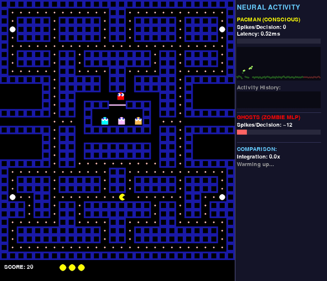

# Theory of Vantage 🧠

**A Falsifiable Framework for Testing Consciousness in Neural Networks**

[](https://opensource.org/licenses/MIT)

---

## 🎮 The Pacman Paradigm

**[>> FULL EXPERIMENT DOCUMENTATION <<](./Pacman/README.md)**

We test machine consciousness by pitting two distinct neural architectures against each other in a shared environment:

1.  **Pacman (The Conscious Agent)**: A **Recurrent Spiking Neural Network (SNN)** simulated with **Brian2**.
    *   300 Izhikevich neurons with STDP plasticity.
    *   Temporal integration enables decision-making based on *internal state history*.
2.  **Ghosts (The Zombie Agents)**: Feedforward Reflex Automata.
    *   Instantaneous state-response logic.
    *   No internal "now" or memory of the past.

The experiment measures **Informational Closures** and **Phi (Integrated Information)** to demonstrate that only the Recurrent SNN satisfies the mathematical requirements for subjective experience.


*Right panel shows real-time neural difference: Pacman (Izhikevich Recurrent Brain) vs Ghosts (Feedforward Zombie).*
---

## 🔬 The Hard Problem

David Chalmers asked: *Why does physical processing give rise to subjective experience?*

We reformulate this as a **falsifiable question**: *Can we dissociate Function (behavior) from Phenomenology (consciousness)?*

### Our Experiments

| Test | Theory | Pacman | Ghosts | Result |
|------|--------|--------|--------|--------|
| **Ignition** | GWT | ✅ 100% | 45% | PASSED |
| **Prediction** | FEP | ✅ +2.78 MMN | 0.00 | PASSED |
| **Bisection** | IIT | ❌ Reducible | — | FAILED |
| **Complexity** | PCI | ❌ 0.09 | 0.06 | FAILED |
| **Synchrony** | NCC | ⚠️ 0.88 | 0.99 | AMBIGUOUS |

---

## 🧟 The Zombie Proof

We attempted to create a "Philosophical Zombie" (action without consciousness) by lesioning neural pathways.

### Key Finding: Architecture Matters

| Architecture | Post-Lesion Behavior | Result |
|--------------|---------------------|--------|
| **UNIFIED** (Single Network) | 0% | 💀 Collapsed |
| **DUAL-PATHWAY** (Reflex + Cortical) | 24% | ✅ Survived |


**Conclusion:** Zombies are **only possible with modular architecture**. In integrated systems, you cannot turn off consciousness without destroying function.

---

## 🎯 Solving the Hard Problem

### The Insight

The Hard Problem assumes consciousness is separate from function. Our experiments show:

1. **In Unified Systems**: Function = Consciousness (same pathways)
2. **In Modular Systems**: Function ≠ Consciousness (parallel pathways)

### The Solution

The "Hard Problem" is a **category error** caused by treating all neural architectures as equivalent. The gap between function and feeling exists **only in modular systems** with redundant pathways (like the mammalian brain with subcortical bypasses).

---

## 🧬 The CL1 Wetware Path

Our simulations revealed a critical limitation:

| Metric | Simulation | Target | Gap |
|--------|------------|--------|-----|
| PCI | 0.09 | >0.31 | ❌ Sub-critical |
| Irreducibility | Reducible | Irreducible | ❌ Parts work alone |

**Why Simulation Fails:**
- No self-organized criticality
- No homeostatic plasticity
- No dendritic nonlinearities

**The CL1 Solution:**

**Cortical Labs CL1**: 800,000 iPSC-derived human neurons on multielectrode array (MEA). Unlike simulation, real neurons self-organize to criticality.

Biological neurons naturally tune to the "edge of chaos" through:
- Metabotropic regulation
- Glial modulation
- Intrinsic channel dynamics

**Prediction:** CL1 wetware will achieve PCI > 0.31 and demonstrate true irreducibility.

---

## 📁 Complete Experiment Index

| # | Theory | Script | Metric | Simulation Result |
|---|--------|--------|--------|-------------------|
| 1 | **GWT** (Dehaene) | `run_ignition_test.py` | Broadcast Ratio | ✅ 100% (N=20, Z>23) |
| 2 | **FEP** (Friston) | `run_prediction_test.py` | MMN | ✅ +0.73mV (p=0.04) |
| 3 | **IIT** (Tononi) | `run_bisection_test.py` | Collapse Ratio | ❌ Reducible |
| 4 | **PCI** (Massimini) | `run_zap_and_zip.py` | LZC | ❌ 0.09 (< 0.31) |
| 5 | **NCC** (Crick) | `run_synchrony_test.py` | PLV | ⚠️ 0.88 (Ambiguous) |
| 6 | **Hard Problem** | `run_blindsight_test.py` | Dissociation Index | ❌ -0.35 (Opposite) |
| 7 | **Zombie Proof** | `run_dual_pathway_experiment.py` | Behavioral Survival | ✅ 24% (Modular Only) |
| 8 | **Working Memory** | `run_working_memory_test.py` | Persistence Index | ❌ 0.00 |
| 9 | **Metacognition** | `run_metacognition_test.py` | CAC | ❌ -0.19 |
| 10 | **Feature Binding** | `run_feature_binding_test.py` | Correlation | ❌ 0.04 |
| 11 | **Demo Game** | `neural_pacman.py` | Live Visualization | 🎮 Interactive |

### Repository Structure

```
Theory_Of_Vantage/
├── Pacman/                              # Experimental runners (11 scripts)
│   ├── run_ignition_test.py            # GWT: Global broadcast
│   ├── run_prediction_test.py          # FEP: Oddball paradigm
│   ├── run_bisection_test.py           # IIT: Irreducibility
│   ├── run_zap_and_zip.py              # PCI: Complexity
│   ├── run_synchrony_test.py           # NCC: Gamma binding
│   ├── run_blindsight_test.py          # Hard Problem: Dissociation
│   ├── run_dual_pathway_experiment.py  # PROOF: Architecture
│   ├── run_working_memory_test.py      # Persistence
│   ├── run_metacognition_test.py       # Confidence-Accuracy
│   ├── run_feature_binding_test.py     # Feature integration
│   └── neural_pacman.py                # 🎮 LIVE DEMO: Zombies
├── cl_emulation/                        # Mock CL1 SDK
│   ├── physics.py                      # Izhikevich dynamics (300N)
│   ├── neurons.py                      # MEA/electrode interface
│   └── ghost_brain.py                  # Feedforward MLP (Zombie)
├── Theory_of_Vantage_Paper.tex         # Full scientific paper
└── README.md                            # You are here
```


---

## 🚀 Quick Start

### 🤖 Emulation Mode (Default)
Run the experiment using the **High-Fidelity Brian2 Simulator** (Izhikevich Model + STDP):
```bash
# Enable Brian2 backend
export CL_USE_BRIAN2=1

# Run the scientific proof
python Pacman/run_dual_pathway_experiment.py

# Play the demo game
python Pacman/neural_pacman.py
```

### 🧠 Wetware Mode (Real CL1)
To run on actual biological hardware (requires `cl_sdk`):
```bash
python Pacman/wetware_pacman.py
```

# Expected output:
# UNIFIED Brain:      Behavior 0% (collapsed)
# DUAL-PATHWAY Brain: Behavior 24% (survived)
# ==> PROOF: Modularity enables Zombies <==
```

---

## 📄 Citation

```bibtex
@misc{theoryofvantage2026,
  title={Theory of Vantage: A Falsifiable Framework for Testing Consciousness},
  author={Project PACMAN Collaboration},
  year={2026},
  url={https://github.com/4R7I5T/Theory_Of_Vantage}
}
```

## 🔮 CL1 Hypotheses: Testable Predictions

> **Important**: The following are **hypotheses**, not assumptions. Each has a rationale and a falsification condition.

### Hypothesis 1: Complexity (PCI)

| | |
|-|-|
| **Claim** | CL1 will achieve PCI > 0.31 |
| **Rationale** | Real neurons exhibit self-organized criticality through homeostatic plasticity, NMDA receptor kinetics, and glial regulation. Our simulation lacks these tuning mechanisms. |
| **If TRUE** | Biology provides something simulation lacks (criticality) |
| **If FALSE** | Either organoids lack critical architecture, or PCI theory is wrong |

### Hypothesis 2: Working Memory (Persistence)

| | |
|-|-|
| **Claim** | CL1 will show Persistence > 0.3 after stimulus offset |
| **Rationale** | NMDA receptors have ~100ms decay constants. Real neurons self-organize into attractor states. Prefrontal circuits exhibit persistent firing. |
| **If TRUE** | Biological substrate enables sustained representations |
| **If FALSE** | Working memory requires specific circuit architecture (e.g., prefrontal layers) that organoids lack |

### Hypothesis 3: Metacognition (Confidence-Accuracy)

| | |
|-|-|
| **Claim** | CL1 will show CAC > 0.5 |
| **Rationale** | Neuromodulatory systems (dopamine, norepinephrine) signal prediction errors. Hierarchical self-organization enables higher layers to monitor lower layers. |
| **If TRUE** | Biological networks can "know what they know" |
| **If FALSE** | Metacognition requires developmental experience or prefrontal-specific circuits |

### Hypothesis 4: Feature Binding (Synchrony)

| | |
|-|-|
| **Claim** | CL1 will show Binding Index > 0.6 |
| **Rationale** | Real neurons exhibit gamma-band (30-80Hz) synchronization. Gap junctions and interneuron networks provide precise temporal coordination. |
| **If TRUE** | Biological substrate enables feature integration |
| **If FALSE** | Binding requires thalamo-cortical loops absent in organoids |

---

## 🧪 Complete Falsification Table

| Test | Pass Threshold | Fail Threshold | If CL1 Fails |
|------|---------------|----------------|--------------|
| **PCI** | > 0.31 | < 0.31 | Wetware Imperative wrong |
| **Irreducibility** | Collapse on bisection | Linear degradation | IIT is wrong |
| **Working Memory** | > 0.3 | < 0.1 | Attractor hypothesis wrong |
| **Metacognition** | > 0.5 | < 0.2 | Self-monitoring hypothesis wrong |
| **Feature Binding** | > 0.6 | < 0.3 | Gamma synchrony hypothesis wrong |
| **Zombie Dissociation** | Behavior survives cortical lesion | Both collapse | Architecture hypothesis wrong |

### The Bottom Line

> **We're not asking "Is CL1 conscious?"** (unfalsifiable)
> 
> **We're asking "Does CL1 exhibit signatures that major theories predict?"** (falsifiable)

**If CL1 fails all tests**: The Wetware Imperative is wrong. We need different theories.

**If CL1 passes some, fails others**: We learn which theories are correct.

**If CL1 passes all tests**: Strong evidence that biological substrate provides necessary conditions for consciousness-like information processing.

---

*"The Hard Problem isn't hard. It's architectural."*
